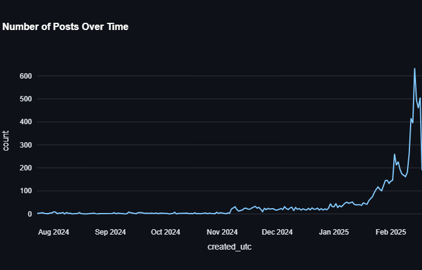
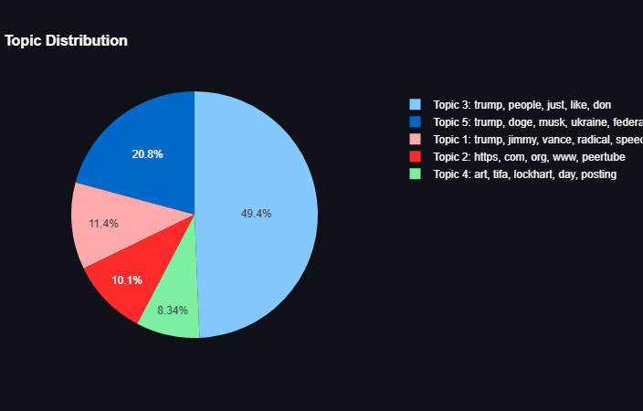
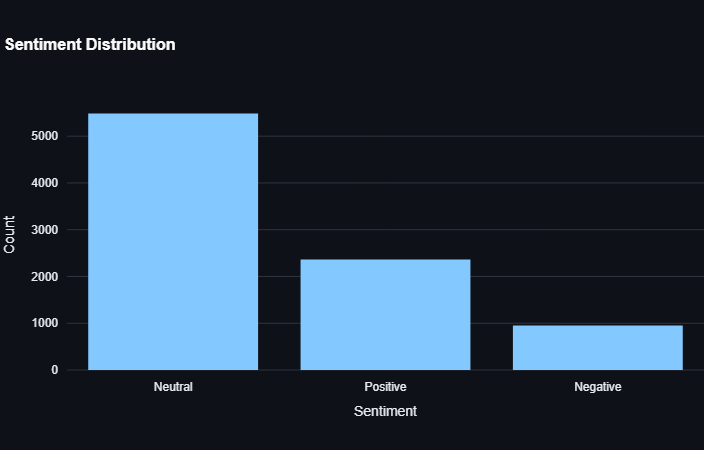

# **Reddit Data Analysis Dashboard**

Welcome to the **Reddit Data Analysis Dashboard**! This project is a Streamlit-based web application that allows users to analyze Reddit data interactively. It provides insights into sentiment analysis, topic modeling, user activity, and more.

---

## **Table of Contents**

1. [Project Overview](#project-overview)
2. [Features](#features)
3. [System Design](#system-design)
4. [Implementation Details](#implementation-details)
5. [Data Flow](#data-flow)
6. [How to Use](#how-to-use)
7. [Screenshots](#screenshots)
8. [Video Demo](#video-demo)
9. [Deployment](#deployment)
10. [Contributing](#contributing)

---

## **Project Overview**

This dashboard is designed to help users analyze Reddit data by providing:

- **Sentiment Analysis**: Categorize posts as positive, negative, or neutral using TextBlob.
- **Topic Modeling**: Identify key topics in Reddit posts using Latent Dirichlet Allocation (LDA).
- **User Activity Analysis**: Analyze the most active users and their engagement patterns.
- **Interactive Visualizations**: Explore data through time series, pie charts, scatterplots, and more.

---

## **Features**

- **Sentiment Analysis**:
  - Analyze sentiment distribution across posts.
  - View top positive and negative posts.
  - Track sentiment trends over time.
- **Topic Modeling**:
  - Extract key topics from post titles using LDA.
  - Visualize topic trends over time.
  - Identify emerging discussion themes.
- **User Activity Analysis**:
  - Identify the most active users and their engagement patterns.
  - Analyze the relationship between post frequency and popularity.
- **Interactive Filters**:
  - Filter data by date, subreddit, sentiment, or upvote count.
  - Dynamically update visualizations based on filters.
- **Chatbot**:
  - Ask questions about the data using a GPT-2-based chatbot.
- **Export Functionality**:
  - Export analysis results as CSV files.
  - Export raw or filtered datasets for further analysis.

---

## **System Design**

### **Code Structure**

```
📂C:.
├───📜 app.py                # Main Streamlit app entry point
├───📖 README.md             # Project documentation
├───📝 requirements.txt      # Required dependencies
├───📂 data/                 # Sample datasets
│   └───📜 dataset.jsonl     # Raw Reddit data in JSONL format
├───📂 screenshots/          # Screenshots of the dashboard
│   ├───📷 time_series.png   # Time series visualization
│   ├───📷 topic_dist.png    # Topic distribution visualization
│   └───📷 sentiment.png     # Sentiment analysis visualization
```

---

## **Implementation Details**

### **Key Components and Technologies**

1. **Core Framework**:
   - **Streamlit**: Powers the interactive web interface and dashboard components.
   - **Pandas**: Handles data manipulation and analysis.

2. **Analysis Libraries**:
   - **TextBlob**: Used for sentiment analysis, specialized for social media text.
   - **Scikit-learn**: Implements topic modeling through Latent Dirichlet Allocation (LDA) and TF-IDF vectorization.
   - **Transformers**: Provides GPT-2-based chatbot functionality.

3. **Visualization Technologies**:
   - **Plotly**: Creates interactive charts (pie charts, scatterplots, bar charts).
   - **WordCloud**: Generates visual representations of word frequency.

4. **Data Handling**:
   - Supports JSONL data format.
   - Implements comprehensive filtering mechanisms (date, subreddit, sentiment, upvotes).
   - Provides data export capabilities.

---

## **Data Flow**

The application follows a clear data flow pattern:

1. **Data Ingestion**:
   - User uploads JSONL data through the Streamlit interface.
   - Data is loaded into a Pandas DataFrame.

2. **Data Preprocessing**:
   - Raw text is cleaned and combined (title + selftext).
   - Date fields are converted to proper datetime format.

3. **Analysis Pipeline**:
   - **Sentiment Analysis**:
     - Text is processed through TextBlob sentiment analyzer.
     - Posts are categorized as positive, negative, or neutral.
   - **Topic Modeling**:
     - Text is vectorized using TF-IDF.
     - LDA is applied to identify key topics.
   - **User Activity Analysis**:
     - Count posts per user and visualize the most active users.

4. **Filtering**:
   - User-selected filters are applied to the dataset.
   - Date ranges, subreddits, sentiment categories, and upvote thresholds can be applied.

5. **Visualization**:
   - Processed data is visualized through multiple chart types.
   - Interactive elements allow user exploration.

---

## **How to Use**

1. **Install Dependencies**:

   ```bash
   pip install -r requirements.txt
   ```

2. **Run the App Locally**:

   ```bash
   streamlit run app.py
   ```

3. **Upload a Dataset**:
   - Upload a JSONL file containing Reddit data.
   - The application expects columns like 'title', 'selftext', 'author', 'subreddit', 'created_utc', 'score', and 'num_comments'.

4. **Explore the Dashboard**:
   - Use the sidebar to filter data by date range, subreddit, upvote count, and sentiment.
   - Navigate through different analysis tabs to explore various insights.
   - Export findings as needed for further analysis.

---

## **Screenshots**

### **1. Time Series of Posts**



### **2. Topic Distribution**



### **3. Sentiment Analysis**



---

## **Video Demo**

Watch the video demo of the dashboard in action:

- [Google Drive Link](https://drive.google.com/file/d/your-video-id/view)

---

## **Deployment**

The dashboard is hosted on **Streamlit Sharing**:

- [Live Dashboard]([https://your-dashboard-url.streamlit.app](https://socialanalysis.streamlit.app/))

---

## **Contribution**

By @PrathameshDesai0409

---

### **Acknowledgments**

- **Streamlit** for the amazing framework.
- **TextBlob** for sentiment analysis.
- **Plotly** for interactive visualizations.
- **Scikit-learn** for machine learning functionality.
- **Transformers** for the GPT-2-based chatbot.
